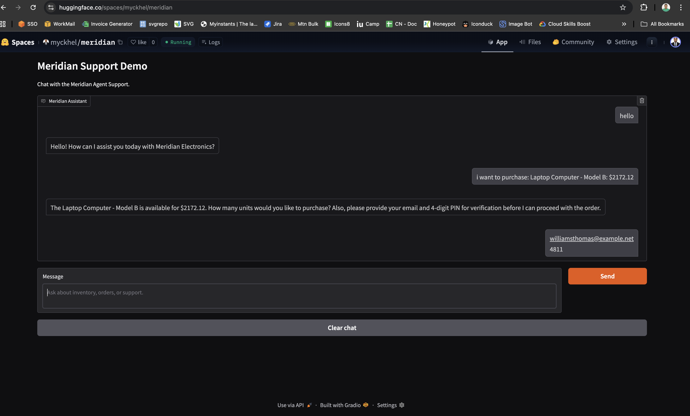
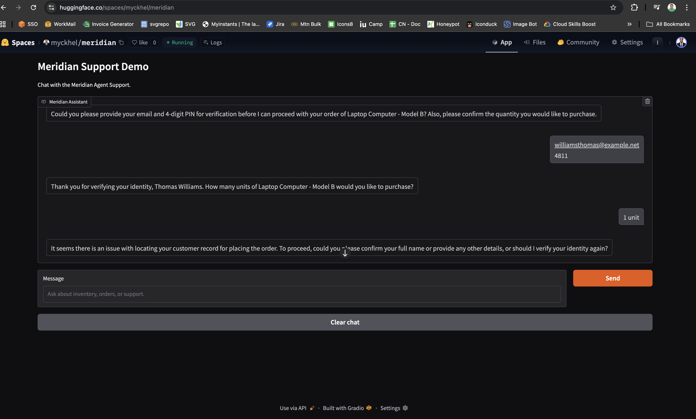
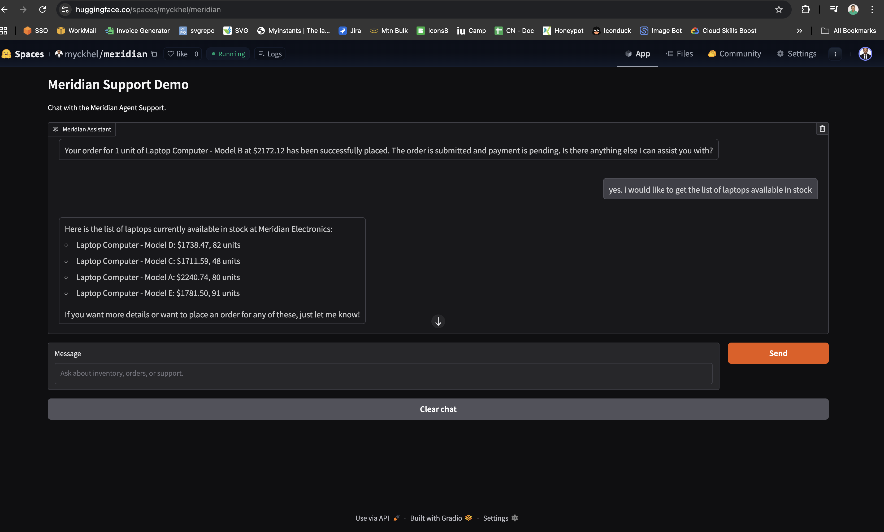
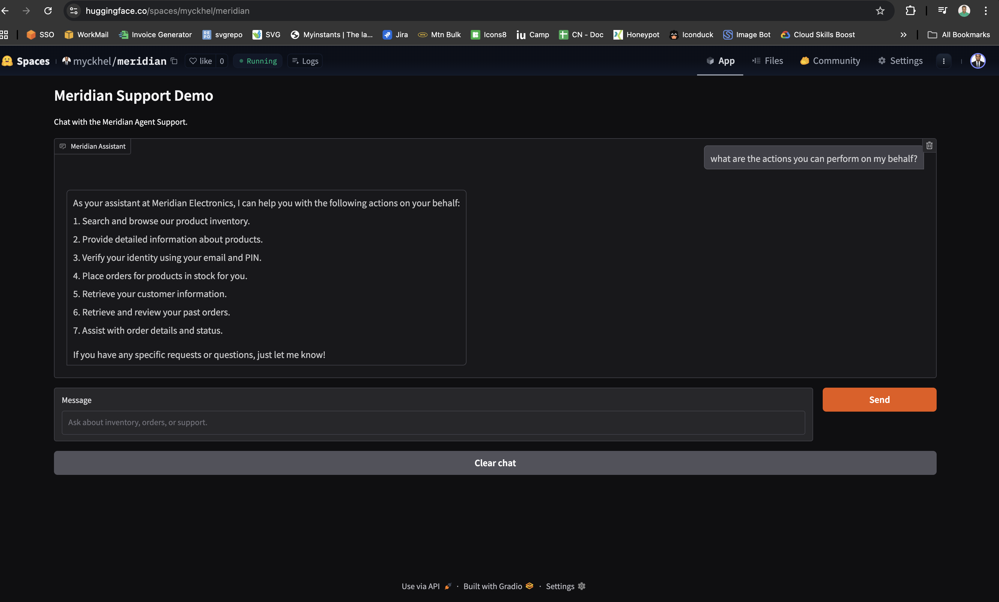

# Meridian FastAPI Scaffold

## Demo screenshots

### Assistant capabilities overview

Shows the assistant summarizing the actions it can perform on a user's behalf.



### Purchase flow with verification

Shows the assistant prompting for email and PIN before proceeding with an order.



### Order follow-up and inventory lookup

Shows the assistant placing an order, then returning the list of laptops currently in stock.



### Identity verification and order recovery

Shows the assistant handling identity verification and recovering from a customer record lookup issue.



## Run locally

```bash
uv venv
source .venv/bin/activate
uv sync
cp .env.example .env
uv run uvicorn app.main:app --reload
```

In a separate terminal, run the demo UI:

```bash
uv run python -m app.ui.gradio_app
```

## Common uv commands

```bash
uv sync
uv run uvicorn app.main:app --reload
uv add <package>
```

## Make targets

```bash
make install
make dev
make run
make lock
make docker-build
make docker-run
```

## Run with Docker

Build the image:

```bash
docker build -t meridian-api .
```

Start the container with your local environment file:

```bash
cp .env.example .env
docker run --rm -p 8000:8000 --env-file .env meridian-api
```

Or use the provided make targets:

```bash
make docker-build
make docker-run
```

The API will be available at `http://localhost:8000`.

## Available endpoints

- `GET /`
- `GET /api/v1/health`
- `POST /api/v1/chat`

`POST /api/v1/chat` uses the OpenAI Agents SDK to route user requests through the Meridian MCP tools.

## Deploy to Hugging Face Spaces

This repo can be deployed as a Gradio Space.

Required Space secrets:

- `OPENAI_API_KEY`

Optional Space secrets or variables:

- `OPENAI_BASE_URL` or `OPENAI_API_BASE_URL`
- `OPENAI_MODEL`
- `MCP_SERVER_URL`

Deployment notes:

- The Gradio app can call the FastAPI backend when `CHAT_API_URL` is reachable.
- In Hugging Face Spaces, the UI falls back to the in-process chat service, so no separate API process is required.